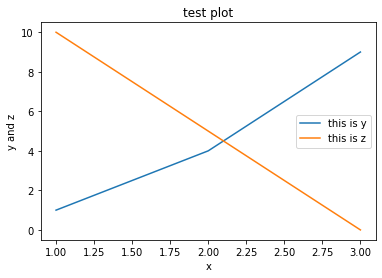
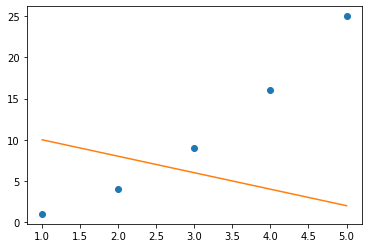
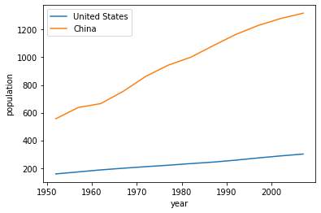
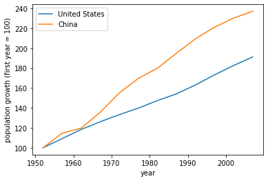

```python
import pandas as pd
```


```python
from matplotlib import pyplot as plt
```


```python
x = [1,2,3]
y = [1,4,9]
z = [10,5,0]
plt.plot(x, y)
plt.plot(x,z)
plt.title('test plot')
plt.xlabel('x')
plt.ylabel('y and z')
plt.legend(['this is y', 'this is z'])
plt.show()
```





```python
sample_data = pd.read_csv('sample_data.csv')
```


```python
sample_data
```


<div>
<style scoped>
    .dataframe tbody tr th:only-of-type {
        vertical-align: middle;
    }

    .dataframe tbody tr th {
        vertical-align: top;
    }

    .dataframe thead th {
        text-align: right;
    }
</style>
<table border="1" class="dataframe">
  <thead>
    <tr style="text-align: right;">
      <th></th>
      <th>column_a</th>
      <th>column_b</th>
      <th>column_c</th>
    </tr>
  </thead>
  <tbody>
    <tr>
      <th>0</th>
      <td>1</td>
      <td>1</td>
      <td>10</td>
    </tr>
    <tr>
      <th>1</th>
      <td>2</td>
      <td>4</td>
      <td>8</td>
    </tr>
    <tr>
      <th>2</th>
      <td>3</td>
      <td>9</td>
      <td>6</td>
    </tr>
    <tr>
      <th>3</th>
      <td>4</td>
      <td>16</td>
      <td>4</td>
    </tr>
    <tr>
      <th>4</th>
      <td>5</td>
      <td>25</td>
      <td>2</td>
    </tr>
  </tbody>
</table>
</div>


```python
type(sample_data)
```


    pandas.core.frame.DataFrame


```python
sample_data.column_c.iloc[1]
```


    8


```python
plt.plot(sample_data.column_a, sample_data.column_b, 'o')
plt.plot(sample_data.column_a, sample_data.column_c)
plt.show()
```





```python
data = pd.read_csv('countries.csv')
```


```python
data
```


<div>
<style scoped>
    .dataframe tbody tr th:only-of-type {
        vertical-align: middle;
    }

    .dataframe tbody tr th {
        vertical-align: top;
    }

    .dataframe thead th {
        text-align: right;
    }
</style>
<table border="1" class="dataframe">
  <thead>
    <tr style="text-align: right;">
      <th></th>
      <th>country</th>
      <th>year</th>
      <th>population</th>
    </tr>
  </thead>
  <tbody>
    <tr>
      <th>0</th>
      <td>Afghanistan</td>
      <td>1952</td>
      <td>8425333</td>
    </tr>
    <tr>
      <th>1</th>
      <td>Afghanistan</td>
      <td>1957</td>
      <td>9240934</td>
    </tr>
    <tr>
      <th>2</th>
      <td>Afghanistan</td>
      <td>1962</td>
      <td>10267083</td>
    </tr>
    <tr>
      <th>3</th>
      <td>Afghanistan</td>
      <td>1967</td>
      <td>11537966</td>
    </tr>
    <tr>
      <th>4</th>
      <td>Afghanistan</td>
      <td>1972</td>
      <td>13079460</td>
    </tr>
    <tr>
      <th>5</th>
      <td>Afghanistan</td>
      <td>1977</td>
      <td>14880372</td>
    </tr>
    <tr>
      <th>6</th>
      <td>Afghanistan</td>
      <td>1982</td>
      <td>12881816</td>
    </tr>
    <tr>
      <th>7</th>
      <td>Afghanistan</td>
      <td>1987</td>
      <td>13867957</td>
    </tr>
    <tr>
      <th>8</th>
      <td>Afghanistan</td>
      <td>1992</td>
      <td>16317921</td>
    </tr>
    <tr>
      <th>9</th>
      <td>Afghanistan</td>
      <td>1997</td>
      <td>22227415</td>
    </tr>
    <tr>
      <th>10</th>
      <td>Afghanistan</td>
      <td>2002</td>
      <td>25268405</td>
    </tr>
    <tr>
      <th>11</th>
      <td>Afghanistan</td>
      <td>2007</td>
      <td>31889923</td>
    </tr>
    <tr>
      <th>12</th>
      <td>Albania</td>
      <td>1952</td>
      <td>1282697</td>
    </tr>
    <tr>
      <th>13</th>
      <td>Albania</td>
      <td>1957</td>
      <td>1476505</td>
    </tr>
    <tr>
      <th>14</th>
      <td>Albania</td>
      <td>1962</td>
      <td>1728137</td>
    </tr>
    <tr>
      <th>15</th>
      <td>Albania</td>
      <td>1967</td>
      <td>1984060</td>
    </tr>
    <tr>
      <th>16</th>
      <td>Albania</td>
      <td>1972</td>
      <td>2263554</td>
    </tr>
    <tr>
      <th>17</th>
      <td>Albania</td>
      <td>1977</td>
      <td>2509048</td>
    </tr>
    <tr>
      <th>18</th>
      <td>Albania</td>
      <td>1982</td>
      <td>2780097</td>
    </tr>
    <tr>
      <th>19</th>
      <td>Albania</td>
      <td>1987</td>
      <td>3075321</td>
    </tr>
    <tr>
      <th>20</th>
      <td>Albania</td>
      <td>1992</td>
      <td>3326498</td>
    </tr>
    <tr>
      <th>21</th>
      <td>Albania</td>
      <td>1997</td>
      <td>3428038</td>
    </tr>
    <tr>
      <th>22</th>
      <td>Albania</td>
      <td>2002</td>
      <td>3508512</td>
    </tr>
    <tr>
      <th>23</th>
      <td>Albania</td>
      <td>2007</td>
      <td>3600523</td>
    </tr>
    <tr>
      <th>24</th>
      <td>Algeria</td>
      <td>1952</td>
      <td>9279525</td>
    </tr>
    <tr>
      <th>25</th>
      <td>Algeria</td>
      <td>1957</td>
      <td>10270856</td>
    </tr>
    <tr>
      <th>26</th>
      <td>Algeria</td>
      <td>1962</td>
      <td>11000948</td>
    </tr>
    <tr>
      <th>27</th>
      <td>Algeria</td>
      <td>1967</td>
      <td>12760499</td>
    </tr>
    <tr>
      <th>28</th>
      <td>Algeria</td>
      <td>1972</td>
      <td>14760787</td>
    </tr>
    <tr>
      <th>29</th>
      <td>Algeria</td>
      <td>1977</td>
      <td>17152804</td>
    </tr>
    <tr>
      <th>...</th>
      <td>...</td>
      <td>...</td>
      <td>...</td>
    </tr>
    <tr>
      <th>1674</th>
      <td>Yemen, Rep.</td>
      <td>1982</td>
      <td>9657618</td>
    </tr>
    <tr>
      <th>1675</th>
      <td>Yemen, Rep.</td>
      <td>1987</td>
      <td>11219340</td>
    </tr>
    <tr>
      <th>1676</th>
      <td>Yemen, Rep.</td>
      <td>1992</td>
      <td>13367997</td>
    </tr>
    <tr>
      <th>1677</th>
      <td>Yemen, Rep.</td>
      <td>1997</td>
      <td>15826497</td>
    </tr>
    <tr>
      <th>1678</th>
      <td>Yemen, Rep.</td>
      <td>2002</td>
      <td>18701257</td>
    </tr>
    <tr>
      <th>1679</th>
      <td>Yemen, Rep.</td>
      <td>2007</td>
      <td>22211743</td>
    </tr>
    <tr>
      <th>1680</th>
      <td>Zambia</td>
      <td>1952</td>
      <td>2672000</td>
    </tr>
    <tr>
      <th>1681</th>
      <td>Zambia</td>
      <td>1957</td>
      <td>3016000</td>
    </tr>
    <tr>
      <th>1682</th>
      <td>Zambia</td>
      <td>1962</td>
      <td>3421000</td>
    </tr>
    <tr>
      <th>1683</th>
      <td>Zambia</td>
      <td>1967</td>
      <td>3900000</td>
    </tr>
    <tr>
      <th>1684</th>
      <td>Zambia</td>
      <td>1972</td>
      <td>4506497</td>
    </tr>
    <tr>
      <th>1685</th>
      <td>Zambia</td>
      <td>1977</td>
      <td>5216550</td>
    </tr>
    <tr>
      <th>1686</th>
      <td>Zambia</td>
      <td>1982</td>
      <td>6100407</td>
    </tr>
    <tr>
      <th>1687</th>
      <td>Zambia</td>
      <td>1987</td>
      <td>7272406</td>
    </tr>
    <tr>
      <th>1688</th>
      <td>Zambia</td>
      <td>1992</td>
      <td>8381163</td>
    </tr>
    <tr>
      <th>1689</th>
      <td>Zambia</td>
      <td>1997</td>
      <td>9417789</td>
    </tr>
    <tr>
      <th>1690</th>
      <td>Zambia</td>
      <td>2002</td>
      <td>10595811</td>
    </tr>
    <tr>
      <th>1691</th>
      <td>Zambia</td>
      <td>2007</td>
      <td>11746035</td>
    </tr>
    <tr>
      <th>1692</th>
      <td>Zimbabwe</td>
      <td>1952</td>
      <td>3080907</td>
    </tr>
    <tr>
      <th>1693</th>
      <td>Zimbabwe</td>
      <td>1957</td>
      <td>3646340</td>
    </tr>
    <tr>
      <th>1694</th>
      <td>Zimbabwe</td>
      <td>1962</td>
      <td>4277736</td>
    </tr>
    <tr>
      <th>1695</th>
      <td>Zimbabwe</td>
      <td>1967</td>
      <td>4995432</td>
    </tr>
    <tr>
      <th>1696</th>
      <td>Zimbabwe</td>
      <td>1972</td>
      <td>5861135</td>
    </tr>
    <tr>
      <th>1697</th>
      <td>Zimbabwe</td>
      <td>1977</td>
      <td>6642107</td>
    </tr>
    <tr>
      <th>1698</th>
      <td>Zimbabwe</td>
      <td>1982</td>
      <td>7636524</td>
    </tr>
    <tr>
      <th>1699</th>
      <td>Zimbabwe</td>
      <td>1987</td>
      <td>9216418</td>
    </tr>
    <tr>
      <th>1700</th>
      <td>Zimbabwe</td>
      <td>1992</td>
      <td>10704340</td>
    </tr>
    <tr>
      <th>1701</th>
      <td>Zimbabwe</td>
      <td>1997</td>
      <td>11404948</td>
    </tr>
    <tr>
      <th>1702</th>
      <td>Zimbabwe</td>
      <td>2002</td>
      <td>11926563</td>
    </tr>
    <tr>
      <th>1703</th>
      <td>Zimbabwe</td>
      <td>2007</td>
      <td>12311143</td>
    </tr>
  </tbody>
</table>
<p>1704 rows × 3 columns</p>
</div>


```python
# COMPARE POPULATION GROWTH IN USA AND CHINA
```


```python
data[data.country == 'United States']
```


<div>
<style scoped>
    .dataframe tbody tr th:only-of-type {
        vertical-align: middle;
    }

    .dataframe tbody tr th {
        vertical-align: top;
    }

    .dataframe thead th {
        text-align: right;
    }
</style>
<table border="1" class="dataframe">
  <thead>
    <tr style="text-align: right;">
      <th></th>
      <th>country</th>
      <th>year</th>
      <th>population</th>
    </tr>
  </thead>
  <tbody>
    <tr>
      <th>1608</th>
      <td>United States</td>
      <td>1952</td>
      <td>157553000</td>
    </tr>
    <tr>
      <th>1609</th>
      <td>United States</td>
      <td>1957</td>
      <td>171984000</td>
    </tr>
    <tr>
      <th>1610</th>
      <td>United States</td>
      <td>1962</td>
      <td>186538000</td>
    </tr>
    <tr>
      <th>1611</th>
      <td>United States</td>
      <td>1967</td>
      <td>198712000</td>
    </tr>
    <tr>
      <th>1612</th>
      <td>United States</td>
      <td>1972</td>
      <td>209896000</td>
    </tr>
    <tr>
      <th>1613</th>
      <td>United States</td>
      <td>1977</td>
      <td>220239000</td>
    </tr>
    <tr>
      <th>1614</th>
      <td>United States</td>
      <td>1982</td>
      <td>232187835</td>
    </tr>
    <tr>
      <th>1615</th>
      <td>United States</td>
      <td>1987</td>
      <td>242803533</td>
    </tr>
    <tr>
      <th>1616</th>
      <td>United States</td>
      <td>1992</td>
      <td>256894189</td>
    </tr>
    <tr>
      <th>1617</th>
      <td>United States</td>
      <td>1997</td>
      <td>272911760</td>
    </tr>
    <tr>
      <th>1618</th>
      <td>United States</td>
      <td>2002</td>
      <td>287675526</td>
    </tr>
    <tr>
      <th>1619</th>
      <td>United States</td>
      <td>2007</td>
      <td>301139947</td>
    </tr>
  </tbody>
</table>
</div>


```python
us = data[data.country == 'United States']
```


```python
china = data[data.country == 'China']
china
```


<div>
<style scoped>
    .dataframe tbody tr th:only-of-type {
        vertical-align: middle;
    }

    .dataframe tbody tr th {
        vertical-align: top;
    }

    .dataframe thead th {
        text-align: right;
    }
</style>
<table border="1" class="dataframe">
  <thead>
    <tr style="text-align: right;">
      <th></th>
      <th>country</th>
      <th>year</th>
      <th>population</th>
    </tr>
  </thead>
  <tbody>
    <tr>
      <th>288</th>
      <td>China</td>
      <td>1952</td>
      <td>556263527</td>
    </tr>
    <tr>
      <th>289</th>
      <td>China</td>
      <td>1957</td>
      <td>637408000</td>
    </tr>
    <tr>
      <th>290</th>
      <td>China</td>
      <td>1962</td>
      <td>665770000</td>
    </tr>
    <tr>
      <th>291</th>
      <td>China</td>
      <td>1967</td>
      <td>754550000</td>
    </tr>
    <tr>
      <th>292</th>
      <td>China</td>
      <td>1972</td>
      <td>862030000</td>
    </tr>
    <tr>
      <th>293</th>
      <td>China</td>
      <td>1977</td>
      <td>943455000</td>
    </tr>
    <tr>
      <th>294</th>
      <td>China</td>
      <td>1982</td>
      <td>1000281000</td>
    </tr>
    <tr>
      <th>295</th>
      <td>China</td>
      <td>1987</td>
      <td>1084035000</td>
    </tr>
    <tr>
      <th>296</th>
      <td>China</td>
      <td>1992</td>
      <td>1164970000</td>
    </tr>
    <tr>
      <th>297</th>
      <td>China</td>
      <td>1997</td>
      <td>1230075000</td>
    </tr>
    <tr>
      <th>298</th>
      <td>China</td>
      <td>2002</td>
      <td>1280400000</td>
    </tr>
    <tr>
      <th>299</th>
      <td>China</td>
      <td>2007</td>
      <td>1318683096</td>
    </tr>
  </tbody>
</table>
</div>


```python
plt.plot(us.year, us.population / 10 ** 6)
plt.plot(china.year, china.population / 10**6)
plt.legend(['United States', 'China'])
plt.xlabel('year')
plt.ylabel('population')
plt.show()
```





```python
us.population
```


    1608    157553000
    1609    171984000
    1610    186538000
    1611    198712000
    1612    209896000
    1613    220239000
    1614    232187835
    1615    242803533
    1616    256894189
    1617    272911760
    1618    287675526
    1619    301139947
    Name: population, dtype: int64


```python
us.population / us.population.iloc[0] * 100
```


    1608    100.000000
    1609    109.159457
    1610    118.396984
    1611    126.123908
    1612    133.222471
    1613    139.787246
    1614    147.371256
    1615    154.109114
    1616    163.052553
    1617    173.219018
    1618    182.589685
    1619    191.135648
    Name: population, dtype: float64


```python
plt.plot(us.year, us.population / us.population.iloc[0] * 100)
plt.plot(china.year, china.population / china.population.iloc[0] * 100)
plt.legend(['United States', 'China'])
plt.xlabel('year')
plt.ylabel('population growth (first year = 100)')
plt.show()
```





```python

```
